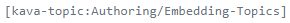
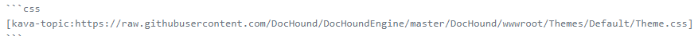

# Embedding Topics Within Other Topics

In Kava Docs, it is possible to embed topics within other topics. This can be done by putting a topic placeholder inside of another topic, like so:

The topic name is the "slug" of the topic. For instance, this topic you are currently looking at is accessed using *Authoring/Embedding-Topics* as the "slug" (the part of the URL that identifies the topic). You can see this when you look at the address bar in your browser. If you wanted to embed this topic inside of another topic, you could use the following text:

Note that it is possible to use as many such placeholders in a single document as you want. It is also possible for the referenced documents to use their own placeholders. (Note: This poses the problem that scenarios could become recursive, but the DocHound rendering engine catches this kind of recursion).

## Embedding Content from Full URLs

Note that it is also possible to use the placeholder to embed full URLs. Consider this example:

This is used inside of Markdown (although topic placeholders can be used in many other topic types as well) inside of a code-block that is marked as CSS. Therefore, the file referenced by URL is being included right from GitHub into the current topic, and since it is inside of a CSS code-block, the syntax coloring engine will pick it up and show it with appropriate formatting for a CSS style sheet. This is very useful when wanting to always show the latest version of any kind of file inline.