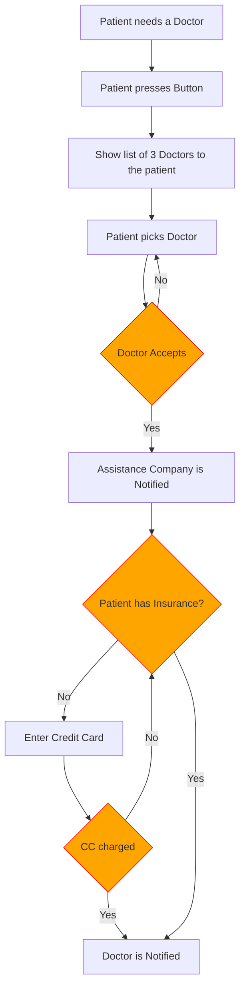
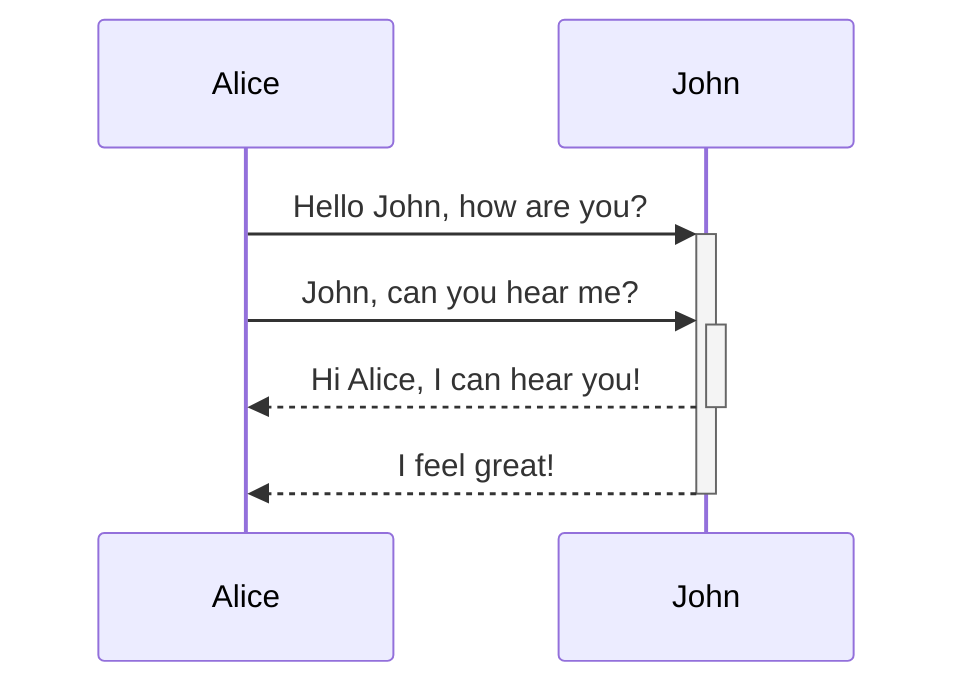
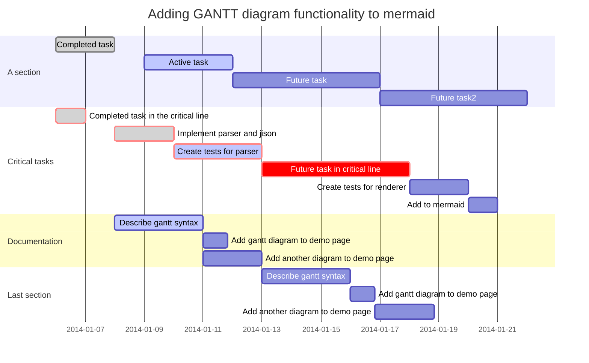

# Mermaid Charts

Kava Docs supports Mermaid charting markup. For specifics on this standard, see https://mermaidjs.github.io/

> Note: Mermaid chart features are automatically enabled when a mermaid block is used in markdown. Mermeid can also be specifically enabled using the `useDiagramsMermaid` setting, which can be set to `true` (the default can be considered to be `auto`, although that is not a setting that can be set explicitly). Note that mermaid can be specifically disabled by setting `useDiagramsMermaid` to `false`.  For more information, see [Table of Contents File Structure](TOC-File-Structure)

## Mermaid Flow Chart

```txt
graph TD;
    A[Patient needs a Doctor]-->B[Patient presses Button];
    B-->C[Show list of 3 Doctors to the patient];
    C-->D[Patient picks Doctor];
    D-->E{Doctor Accepts};
    E-- Yes -->F[Assistance Company is Notified];
    E-- No -->D;
    F-->G{Patient has Insurance?};
    G-- No -->I[Enter Credit Card];
    I-->J{CC charged};
    J-- No -->G;
    J-- Yes -->H;
    G-- Yes -->H[Doctor is Notified];

    style E fill:orange,stroke:red
    style G fill:orange,stroke:red
    style J fill:orange,stroke:red
```



## Mermaid Sequence Diagram

```txt
sequenceDiagram
    Alice->>+John: Hello John, how are you?
    Alice->>+John: John, can you hear me?
    John-->>-Alice: Hi Alice, I can hear you!
    John-->>-Alice: I feel great!
```



## Mermaid Gantt Chart

```txt
gantt
       dateFormat  YYYY-MM-DD
       title Adding GANTT diagram functionality to mermaid

       section A section
       Completed task            :done,    des1, 2014-01-06,2014-01-08
       Active task               :active,  des2, 2014-01-09, 3d
       Future task               :         des3, after des2, 5d
       Future task2              :         des4, after des3, 5d

       section Critical tasks
       Completed task in the critical line :crit, done, 2014-01-06,24h
       Implement parser and jison          :crit, done, after des1, 2d
       Create tests for parser             :crit, active, 3d
       Future task in critical line        :crit, 5d
       Create tests for renderer           :2d
       Add to mermaid                      :1d

       section Documentation
       Describe gantt syntax               :active, a1, after des1, 3d
       Add gantt diagram to demo page      :after a1  , 20h
       Add another diagram to demo page    :doc1, after a1  , 48h

       section Last section
       Describe gantt syntax               :after doc1, 3d
       Add gantt diagram to demo page      :20h
       Add another diagram to demo page    :48h
```


