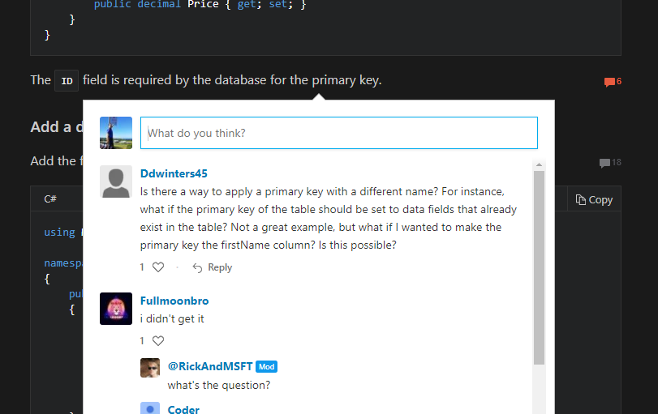

# Kava Docs - To-Do List

## Must-Haves for Minimum Viable Product

* [ ] Landing Page Web Site (www.kavadocs.com) 
* [ ] Accounts and Log-Ins
* [ ] A few more supported sources
    * [ ] DOCX
    * [ ] OneNote
    * [x] VSTS Work Items (almost done, except for fringe features)
    * [ ] ...?
* [x] Themes
* [ ] Full index search
* [ ] Analytics integration (probably support different ones)
* [x] Wildcard domain support
* [ ] Need an editor for the TOC live on the kavadocs.com site
* [ ] Create fundamental documentation for how to use and customize Kava Docs

## Rendering Engine

* [ ] We shoudl allow setting font sizes. This would be especially useful on mobile devices, where people can't just zoom in.
* [ ] Seems when navigating within VSTS topics, going back doesn't always seem to work right. (Note: This may not be an issue anymore... we'll keep an eye on it)
* [ ] Themes
    * [ ] Default theme (similar to the Docs used by MS, or Angular,...)
    * [ ] Sepia theme (similar to https://www.raspberrypi.org/documentation/)
    * [ ] Theme similar to ReadTheDocs.com (such as http://docs.smartthings.com/en/latest/)
    * [ ] Screencast has their own take on documentation: https://support.techsmith.com/hc/en-us/categories/203255908?utm_source=product&utm_medium=screencast&utm_campaign=unknown
    * [ ] Theme similar to Apple docs (such as https://help.apple.com/iphone/11/)
    * [ ] Maybe something more like an article (such as https://www.tomsguide.com/us/samsung-galaxy-s7-guide,review-3456.html)
    * [ ] Would be nice to have a good theme for consumer related things, such as games (such as https://dev.battle.net/docs/read/oauth or even https://worldofwarcraft.com/en-us/game/new-players-guide). We will also need a better way to associate banner art with topics (and similar art customizations)
    * [ ] Microsoft's consumer docs are slightly simpler than their other docs, and that might be good to support for us: https://support.microsoft.com/en-us/products/windows?os=windows-10
    * [ ] Ionic has some interesting and clean stuff. Not too different from our standard theme, but some nice integration of a preview feature: https://ionicframework.com/docs/
    * [ ] Twilio has some interesting stuff that looks a bit different: https://www.twilio.com/docs/sms
    * [ ] Skype has some interesting stuff going: https://support.skype.com/en/skype/windows-desktop/start/
    * [ ] Not sure if we should do something more old fashioned like this: https://docs.blesta.com/display/user/Overview
    * [ ] Or another somewhat old fashioned option: https://docs.whmcs.com/Importing_Data
    * [ ] Stripes: Should we support something like this? https://stripe.com/docs/api/curl#authentication
    * [ ] People seem to like http://en.cppreference.com/w/
    * [ ] Should we support something similar to the Wikipedia format? It's a format a lot of people know...
    * Maybe we can find some more inspiration here: https://documentor.in/2148/best-examples-product-documentation-guides/
* [ ] Allow for different templates (or CSS styles) for different topics or topic trees. For instance, I would like to show the CODE Ohana booklet topics with a different page template (sepia Hawaiian theme) from other topics
* [ ] Code
    * [ ] Support copy & Paste of code snippets (have an icon in the header that people can click on to copy)
    * [ ] Maybe we could even show the name of the language at the top of the snippet
    * [ ] Would be nice to have a setting that allows specifying the max height for a code snippet. If it is taller, it could show an expand/collapse button.
* [ ] Markdown improvements
    * [ ] Support FontAwesome
    * [x] Would be nice to have options for all markdown extensions (like SmartyPants and all that... see also: [Supported Markdown Features](Supported Markdown Features))
    * [x] Take a look at all the standard (optional) Markdig features to see what should be supported in ours (probably a lot)
    * [x] Would be nice to support math notation
    * [x] Would be nice to support flow charts and other charts (such as UML) - (mermaid and nomnoml)
    * [x] Markdown needs to do a better job of fixing up image links
* [ ] Html
    * [ ] Only use HTML body
    * [ ] Should we eliminate scripts from HTML topics?
* [ ] Styling
    * [x] For mobile devices, we should use slightly larger font. Ours seems to be smaller than that found in other docs. (Note: Ended up updating all fonts to fit more what Microsoft is doing on their docs).
    * [x] Maybe text within tables should not be justified
    * [x] Heading tags def. should be left-aligned rather than justified
    * [x] Inline code should be a bit more visible
    * [x] Checkboxes (such as in this list) currently look pretty bad. (GitHub has a better style for these)
    * [x] H3 needs to get their own style
    * [x] Need good default styles for tables
    * [x] Need good default style for blockquotes
    * [x] Should have better styles for the links to sub-topics created automatically when a parent topic is empty.
    * [x] Text within tables doesn't look all that great and should be improved
* [x] Need a loading indicator for dynamic topics showing up when loading takes longer than a half a second (or so)
* [x] Next/Previous buttons do not yet participate in loading topics dynamically
* [x] Must set selected topic (with extended ability to find what's selected) and scroll it into view (and expand it if need be) when loading typics dynamically
* [x] Dynamically loaded documents do not yet get their theme selectors set correctly.
* [x] Showing the outline with indent levels
* [x] Make the current tab work on mobile (responsive)
* [x] Handle image paths relative to documents stored in root folders properly
* [x] It would probably make sense to turn certain features on automatically. For instance, if we find a nomnoml-block, it is probably safe to assume we should turn the feature on for that topic. The default setting for that feature would then essentially be "auto". (Note: This makes sense for mermaid and nomnoml charts, but not for math, since math is too hard to detect reliably, and the overhead of accidentally including it is considerable). 

## Overall Processing

* [ ] Would be really nice to support translations right inline in a document.
* [ ] No hardcoding of any elements
   * [ ] The name of the logo file shouldn't be hardcoded, but a setting in the TOC file instead. (We can still use the current approach as a fall-back)
   * [ ] The footer content needs to be customizable
   * [ ] Sidebar content needs to be customizable
   * [x] The site icon needs to be customizable
* [ ] Topics in the TOC should have a "visible" or "hidden" flag, so they can be managed in the tree (and be considered for URL patterns and such), but not displayed as part of the tree. This is useful in a number of scenarios. For instance, one could create a custom slug the topic can be found by, even though we may not want it in the tree (such as when embedding a document inside of another). It is also useful for tooling, such as when we want a tool that shows all files that are not yet referenced by the TOC (which could get annoying if you have files you really do not want to show up in the tree).
* [ ] Should support a way to add custom themes and Razor templates without requiring a re-deploy
* [ ] When there is a slug passed in that doesn't seem to go with a specific topic, we should show an appropriate message, rather than defaulting back to the first topic
* [ ] Allow overriding of CSS styles on individual topics
* [ ] Some themes may want the current-doc outline more in the document and below the first heading (or some other arbitrary place)
* [ ] Maybe there should be a link to the next topic in the sidebar in some themes?
* [ ] The fav-icon needs to be configurable
* [ ] Make sure that all the data in the topic is data-driven (from the repository)
* [ ] It would be nice to be able to get away with just once instance of the tree in the document
* [ ] Maybe listing contributors to a topic or all the docs (optional)
* [ ] Maybe we could also show last-edited date on a topic
* [ ] Microsoft shows “estimated time to read” at the top of topics
* [ ] Sharing of documents would be nice (Facebook, Twitter, ... the usual)
* [ ] Flagging topics as favorites would be a nice feature
* [ ] Need to be able to refer to other TOC files as a single node from within a TOC file
    * [ ] We want to do the same inside a topic by having a special placeholder in the doc (we are thinking about a kava-topic HTML tag
* [ ] Edit link right in the topic
* [ ] Threaded discussions, or at least comments
    * [ ] Microsoft docs even allow comments right within a topic. Should we support that?  
* [ ] Would be nice to support cool interactions with linked source code. For instance, could we pull all source files that are flagged for code-review and show them inside the docs, so people authorized to review code could look through the code right there and approve it?
* [ ] Would be nice to somehow support "try it now" for JavaScript examples (and such)
* [ ] PDF export
* [x] Would be nice to allow links to external markdown files (or really any other topic we support) to be brought inline on-demand (so it wouldn't always be there, but it could be 'expanded' in... a good example of this would be in our own [Supported Markdown Features topic](Supported Markdown Features), where I would like to pull in the externally linked explanations of markdown features)
* [ ] Need to get the search implemented
   * [ ] Need the more advanced ability to do a full search across all documents using Azure Search
   * [ ] Keywords and description need to be passed to the fully indexed search as relatively high priority fields
   * [ ] Need to be able to search for KavaDocs repositories in the main KavaDocs.com site
   * [x] Need the basic ability to filter the tree
   * [x] Tree filtering should respect keywords
* [x] Would be nice to have the outline in the current document be a bit more interactive
* [x] Should support slug better
* [x] The MasterUrl settting used by GitHubRaw, should probably be renamed to GitHubMasterUrl
* [x] Would be nice to support theme color switching
* [x] Would be nice to support code-highlight theme switching for topics that have code
* [x] Make the main menu configurable
* [x] Allow overriding of CSS styles
* [x] The tree should invisibly contain keywords so a tree filter will also include keywords
* [x] Document title needs to be picked up from the repository
* [x] Document description needs to be picked up from the repository
* [x] Document keywords needs to be picked up from the repository
* [x] Switch from prettify to highlight
* [x] URL parameters identifying topics should *not* be case sensitive
* [x] Allow for settings on the entire TOC as well as on individual topics

## Other Ideas

* [ ] It would be nice if Doc Hound could serve up a few non-doc pages also, allowing people to build their entire site with Kava Docs. (Example: http://aurelia.io could be almost entirely done in Kava Docs, if we only allowed a few more other pages to be added in interesting ways).
* [ ] We need to make sure that people can export all the content
* [ ] Would be nice to allow users to subscribe to changes and be notified.
