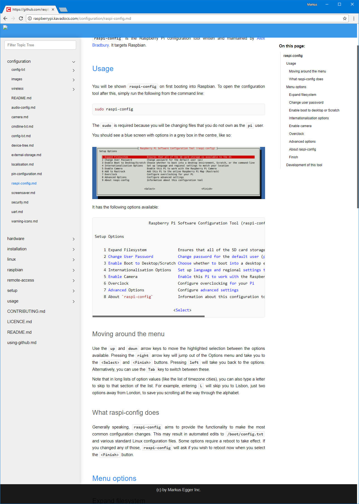

# Tutorial - Connect to an Existing Github Repository

> This tutorial assumes you have an existing Kava Docs account.

## Step 1: Add a new Kava Docs Repository

1. Use the Kava Docs New Repository Wizard to add a new Repository.
2. Pick "Github Raw" as the repository type.
3. Specify the name of an existing Github repository that contains documentation files, preferably authored in Markdown (although this is not a requirement). 

> Note: If you do not have such a repository of your own, you can pick the existing Raspberry Pi documentation repository to follow along with this example. The name is ```raspberrypi/documentation```

The chosen repository is likely not specifically built for Kava Docs and will thus not have a table of contents definition. Therefore, the Kava Docs engine ("DocHound") will crawl the repository (give it a minute, depending on the size of the chosen repository), and come up with a table of contents on the fly, based on the repository's folder structure and the files in the folders.

## Step 2: Choose Options

1. You can now choose further options, such as whether you want to include images as individual pages (this way, images get their own entries in the table of contents, rather than just being there to be used by other topics).
2. You can also choose which types of files you would like to include in your documentation.
3. You can choose to exclude certain common files from being included (such as license information or contributing information)

> Note: Typically, you do not need to change any of these settings, as the defaults work for most scenarios.

## Step 3: Choose a Theme

1. Choose an overall theme for the documentation repository to set the overall look and feel of your docs.
2. If your docs include source code listings, it makes sense to also choose a source code highlight theme to define what syntax highlighting looks like in your docs.

> Note: You can customize the appearance further, once you have created your initial repository.

## Step 4: Save the new Repository

1. Provide a "prefix" for the new repository. The prefix is the name of the repository under which it is accessible. For instance, if you used a ```raspberrypi``` prefix, then the URL under which the repository is accessible will be ```raspberrypi.kavadocs.com```. (Note: The prefix has to be unique).
2. Choose to save the repository.

And that's it! You now have a new repository with an automatically generated table of contents. You can now browse to the newly created documentation repository using the prefix you have chosen. When we went through this exercise ourselves, we chose ```raspberrypi```, therefore, that documentation is now available at http://raspberrypi.kavadocs.com

The result will look similar to this example:

